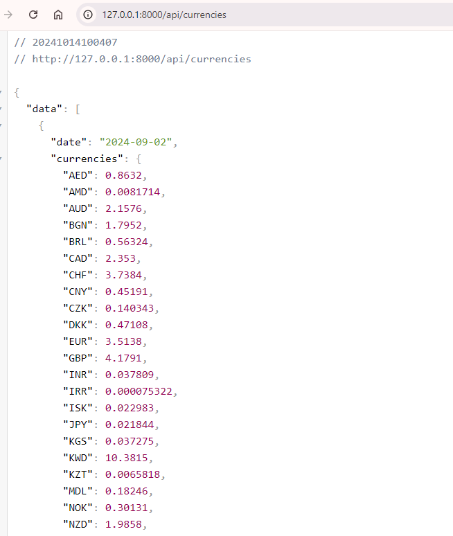
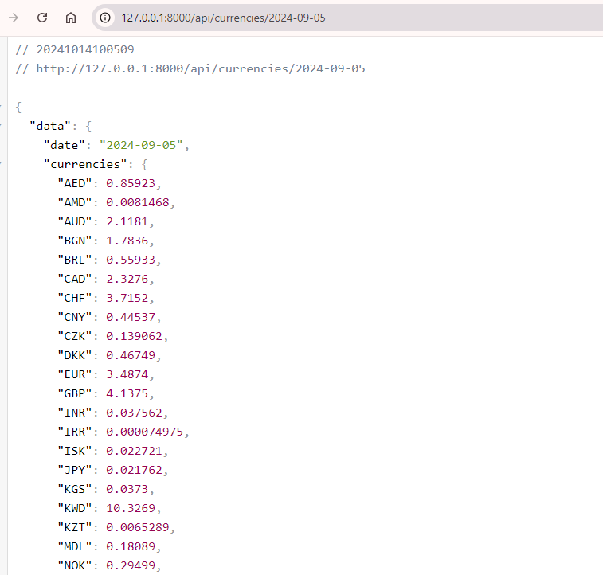

Напишите сервис валютчика:

Раз в сутки должны собираться данные всех курсов валют nbrb по отношению к бел.рублю, https://api.nbrb.by/exrates/rates?periodicity=0;

Реализовывать Http API сервер:
1) метод получения всех записей собранных вами;
2) метод получения записи за выбранный день;
   Технологии: Mysql, Golang, РНР

Установить зависимости
`composer install` 

Установить .env файл и прописать в нём нужные настройки БД
`php -r "file_exists('.env') || copy('.env.example', '.env');`

Создать нужную таблицу
`php artisan migrate`

Заполнить таблицу
`php artisan db:seed`

Запустить сервер
`php artisan serve`

http://127.0.0.1:8000/api/currencies

http://127.0.0.1:8000/api/currencies/2024-09-02

